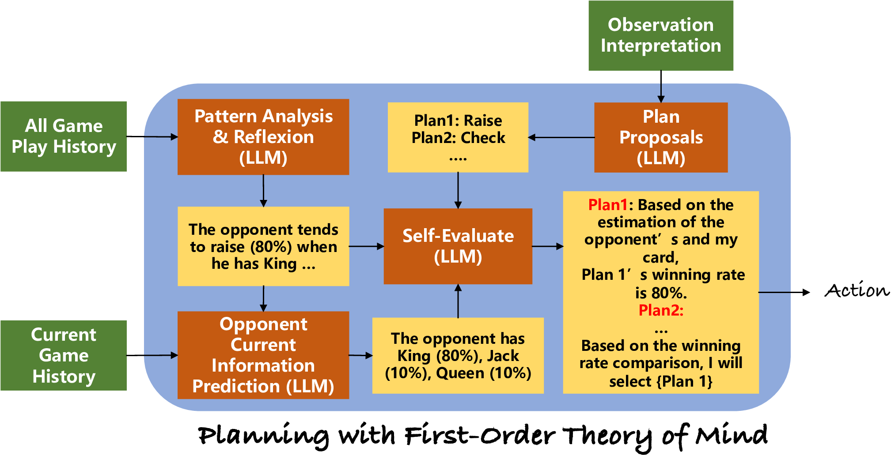
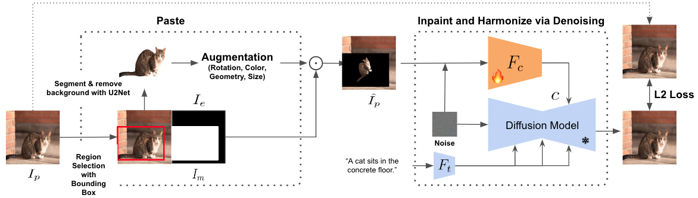
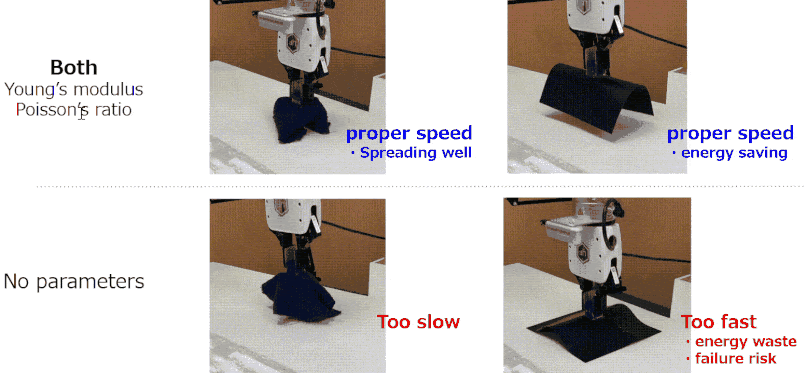
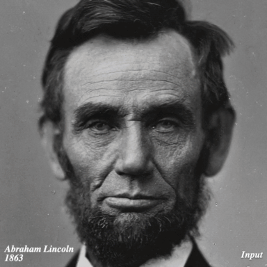
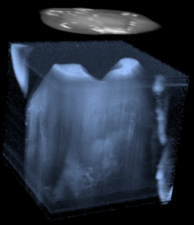

---
title:
layout: default
permalink: /publications/
published: true
---

<head>
<link rel="stylesheet" href="publication_style.css">
</head>

<section id = "publication-list">
				

						

							

								
									
								
							

							

								<header>
									<h3 class="paper-title">DreamSparse: Escaping from Plato’s Cave with 2D Frozen Diffusion Model given Sparse Views</h3>
		            				<h4><em>NeurIPS 2023</em></h4>
									<h4><em>CVPRW 2023 XRNeRF</em></h4>
		               				

		          						<b><u>Paul Yoo</u></b>,
										<a class="button" href="https://cr-gjx.github.io/">Jiaxian Guo</a>,
										<a class="button" href="http://ymatsuo.com/index.html">Yutaka Matsuo</a>,
										<a class="button" href="https://sites.google.com/view/gugurus/home">Shixiang Shane Gu</a>
									

								</header>
								<ul>
			               			<a class="button alt" href="https://sites.google.com/view/dreamsparse-webpage" target="_blank">[Project Page]</a>
			               			<a class="button" href="https://arxiv.org/abs/2306.03414" target="_blank">[Paper]</a>
								</ul>
							
	
						

					

				

						

							

								
									
								
							

							

								<header>
									<h3 class="paper-title">Suspicion-Agent: Playing Imperfect Information Games with Theory of Mind Aware GPT-4
									</h3>
		            				<h4><em>In Submission</em></h4>
		               				

		          						 Jiaxian Guo*, Bo Yang*, <b><u>Paul Yoo</u></b>, Bill Yuchen Lin, Yusuke Iwasawa, Yutaka Matsuo
									

								</header>
								<ul>
			               			<a class="button alt" href="https://github.com/CR-Gjx/Suspicion-Agent" target="_blank">[Github]</a>
			               			<a class="button" href="" target="_blank">[Paper]</a>
									<a class="button" href="https://huggingface.co/spaces/cr7-gjx/Suspicion-Agent-Demo" target="_blank">[Gameplay Demo]</a>
									<a class="button" href="https://huggingface.co/spaces/cr7-gjx/Suspicion-Agent-Data-Visualization" target="_blank">[Gameplay Visualization]</a>
								</ul>
							
	
						

					

				

						

							

								
									
								
							

							

								<header>
									<h3 class="paper-title">Paste, Inpaint and Harmonize via Denoising: Subject-Driven Image Editing with Pre-Trained Diffusion Model</h3>
		            				<h4><em>In Submission</em></h4>
		               				

									Xin Zhang*, Jiaxian Guo*,
									<b><u>Paul Yoo</u></b>, Yutaka Matsuo, Yusuke Iwasawa
		          					

								</header>
								<ul>
			               			<a class="button alt" href="https://sites.google.com/view/phd-demo-page" target="_blank">[Project Page]</a>
			               			<a class="button" href="https://arxiv.org/abs/2306.07596" target="_blank">[Paper]</a>
								</ul>
							
	
						

					

				

						

							

								
									
								
							

							

								<header>
									<h3 class="paper-title">GenDOM: Generalizable One-shot Deformable Object Manipulation with Parameter-Aware Policy</h3>
		            				<h4><em>In Submission</em></h4>
		               				

		          					So Kuroki, Jiaxian Guo, Tatsuya Matsushima, Takuya Okubo, Masato Kobayashi, Yuya Ikeda, Ryosuke Takanami, <b><u>Paul Yoo</u></b>, Yutaka Matsuo, Yusuke Iwasawa
									

								</header>
								<ul>
			               			<a class="button alt" href="https://sites.google.com/view/gendom/home" target="_blank">Project Page</a>
			               			<a class="button" href="https://arxiv.org/abs/2309.09051" target="_blank">Paper</a>
								</ul>
							

						

					

				<!-- 
 -->
					

						

							

								
									
								
							

							

								<header>
									<h3 class="paper-title">Time-Travel Rephotography</h3>
		            				<h4><em>SIGGRAPH Asia 2021</em></h4>
		               				

		          						Xuan Luo,
		          						Cecilia Zhang,
		          						<b><u>Paul Yoo</u></b>,
			           					Ricardo Martin Brualla,
			           					Jason Lawrence,
			           					Steven M. Seitz

								</header>
								<ul>
			               			<a class="button alt" href="http://time-travel-rephotography.github.io" target="_blank">Project Page</a>
			               			<a class="button" href="https://arxiv.org/abs/2012.12261" target="_blank">Paper</a>
								</ul>
							
	
						

					

				<!-- 
 -->
					

						

							

								
									
								
							

							

								<header>
									<h3 class="paper-title">Towards AR‐assisted visualisation and guidance for imaging of dental decay</h3>
		            				<h4><em>IET Healthcare Technology Letters, 2019</em></h4>
		               				

	               					 Yaxuan Zhou, <b><u>Paul Yoo</u></b>, Yingru Feng, Aditya Sankar, Alireza Sadr, Eric J Seibel
		               				

								</header>
								<ul>
			               			<a class="button" href="https://www.ncbi.nlm.nih.gov/pmc/articles/PMC6952244/" target="_blank">Paper</a>
								</ul>
							
	
						

					

				
